# Product Recommendations with Watson Assistant and Decision Management

This project demonstrates how to leverage Watson Assistant (Watson conversation) to gather information about the customer intent, and propose the best product recommendations from the customer profile, the existing owned products and the set of answers / facts gathered during the conversation.

This project is part of the **IBM Cognitive Reference Architecture** compute model available at https://github.com/ibm-cloud-architecture/refarch-cognitive and https://github.com/ibm-cloud-architecture/refarch-analytics

## Table of contents
* [Architecture](#architecture)
* [Use case](#use_case)
* [Method](#method)
* [Build and run](#build_and_run)
* [Recommendation ruleset explanation](docs/rules.md)
* [ODM Governance practices](docs/odm-governance.md)
* [Simulation with ODM](docs/simulation.md)
* [Deploy to IBM Cloud Private](https://github.com/ibm-cloud-architecture/refarch-integration/tree/master/docs/odm)
* [Watson Assistant Implementation](#watson_assistant_logic)
* [Decision composer project](#odm_decision_composer_project)
* [Broker code explanation](#code_explanation)
* [Compendium](#compendium)

## Architecture
The current project is supporting the following architecture:


The WebApp / Backend For Frontend code is managing the interactions with end users via different channels. For demonstration point of view only the web interface is used. Watson Assistant is supporting the natural language understanding with intent classification and entity extraction, and then the dialog flow. ODM decision engine is used for best action and recommendations as an enrichment service on top of the chatbot conversation.
The solution uses the Watson Assistant context to get facts accumulated during the dialog done with the end user. To deliver accurate recommendations the code needs to enrich the data about the customer so ODM rules will have more data point to implement the business recommendation. API management may be added to the API provider so measurement of API usage can be done.

## Method
From a design and implementation point of view the solution illustrates how to consume a Watson Assistant workspace into [ODM Decision composer](http://ibm.biz/DecisionComposer) to prepare the object model for rule authoring. Use your IBM Cloud credential to connect to Decision Composer.
Once the model and decision are defined, it is possible to get the project loaded into ODM Rule Designer and have developer enriching the rule business object model and add more rules.

*Note*: the Business Rules Service for Bluemix [has been deprecated](https://www.ibm.com/blogs/bluemix/2018/02/deprecating-business-rules-service/), and the code of this demonstration has been adapted to use the new Execution feature within Decision Composer (introduced on May 17th in V0.26).

However, we also deploy ODM on IBM Cloud Private and deploy ruleset and rules to the execution server and Decision Center.

## Use Case
This project shows how a customer could have a dialog with his telco operator when he wants to move / reallocate. The chatbot will detect the intent to move, and ask questions to get the date for the move and the zip code of the new address. The idea is to use the date to check if the telco provider can actually provide a transfer of service before the move date. And to check the available services at the destination address, so as to recommend the best product or bundle.
So the bot gathers the data from the customer, and at a given point of the dialog, the broker will invoke a Decision Service, implemented with ODM Decision Composer, and executed using Decision Composer execution feature, on IBM Cloud.

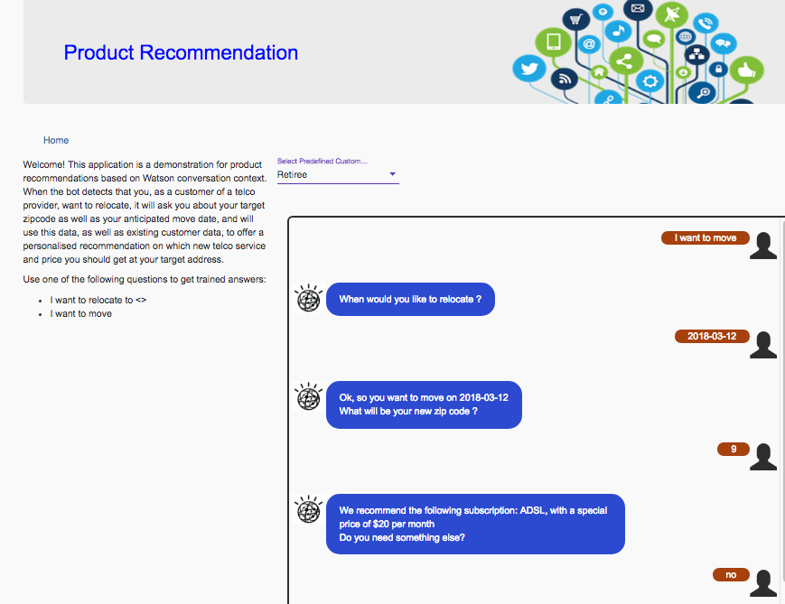

The following screen capture is from the [Case Portal application](https://github.com/ibm-cloud-architecture/refarch-caseportal-app) that is the most updated demonstration app.

## Build and run
The code is a reuse of the conversation broker code detailed in [this project](https://github.com/ibm-cloud-architecture/refarch-cognitive-conversation-broker).

In summary, follow those steps:

1. Clone this repository, you will get the broker code, the source for the Watson Assistant workspace and the ODM Decision Composer project
   * Watson Assistant workspace in [that reference repository](wcs-workspace/Complex-Relocation-workspace.json)
   * ODM Decision Composer project in [that reference repository](odm/composer/Network_subscription_recommendation.dproject)
   * Java model for the execution [XOM project](odm/xom/customer-recommendation-xom)
   * The [rule project](odm/ruleset/ProductRecommendation) to load into Designer or Decision Center.   

1. Create an instance of the Watson Assistant service in your IBM Cloud space, [log into Watson Assitant](https://watson-assistant.ng.bluemix.net/), and import the project from the file `wcs-workspace/Complex-Relocation-workspace.json`, then click on the View Details menu to display the workspace ID, and copy it to the clipboard:  

 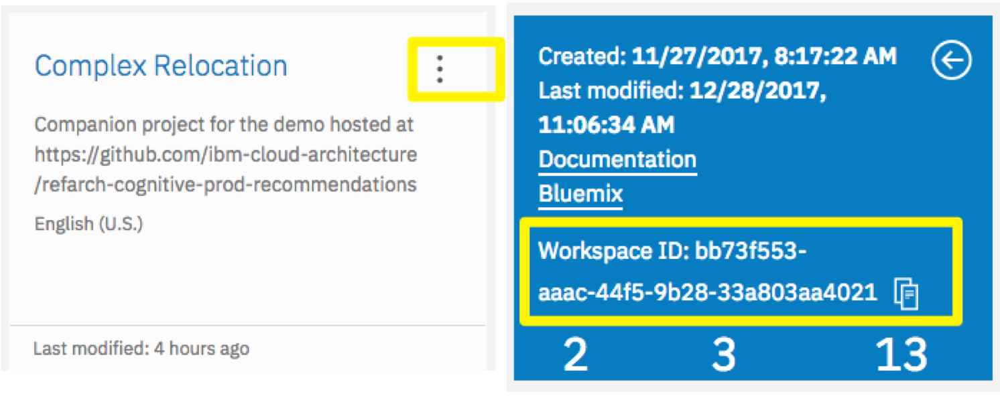  

1. Edit the [the config.json in this project](server/config/config.json) and paste the `WorkspaceId` as the value for the `conversation.workspace` field. While in this file, also set the other credentials correctly. You can generate credentials for access to your instance of Watson Assistant and view them from the _Service Credentials_ page of your service, as show here:

 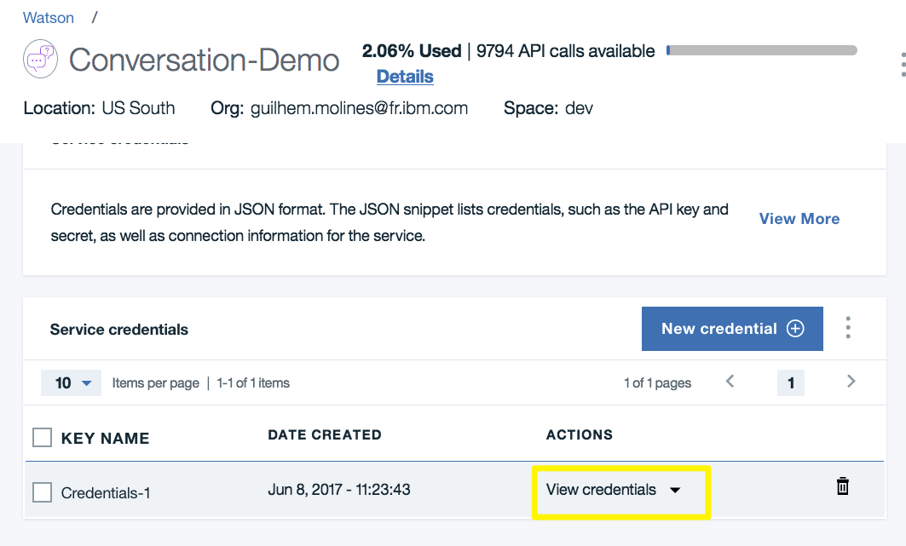

 With these steps done, the broker will now be able to access you own instance of the Watson Assistant service, invoking your own copy of the conversation project.

1. In [ODM Decision composer](http://ibm.biz/DecisionComposer) go to the Settings page:

 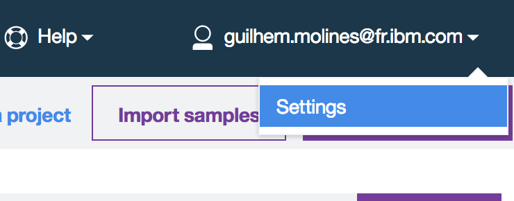

generate a new API Key and copy it in your clipboard.

 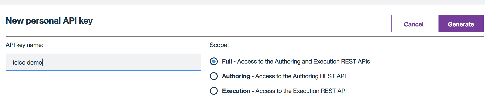

Edit the [the config.json](server/config/config.json) and paste this API key as the value for the `authtoken` field. Be careful to leave "ApiKey " in front of your key, that is the full value of the `authtoken` field should read "ApiKey abcd" if your key is "abcd".

1. In [ODM Decision composer](http://ibm.biz/DecisionComposer) import the _Network_subscription_recommendation_ project and examine it. You can `Test` it within Decision Composer, sample input data is provided. The following screen shot illustrates the a customer, named 'Young' and the output from the rule execution, recommending a Fiber subscription at 25$.  

 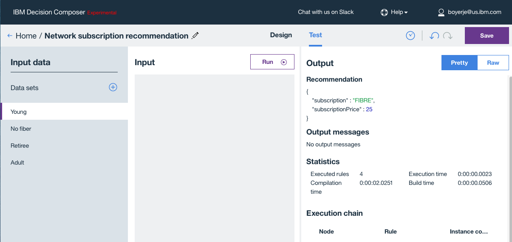

1. Retrieve the REST URL for your decision service: from the Home page of `Decision Composer`, click on the project's menu (three vertical dots) and use the `Execute` choice to display the URL which Decision Composer generates for execution of your project. Take note of the project unique ID and version, and place this information in the [the config.json](server/config/config.json) as shown here:

 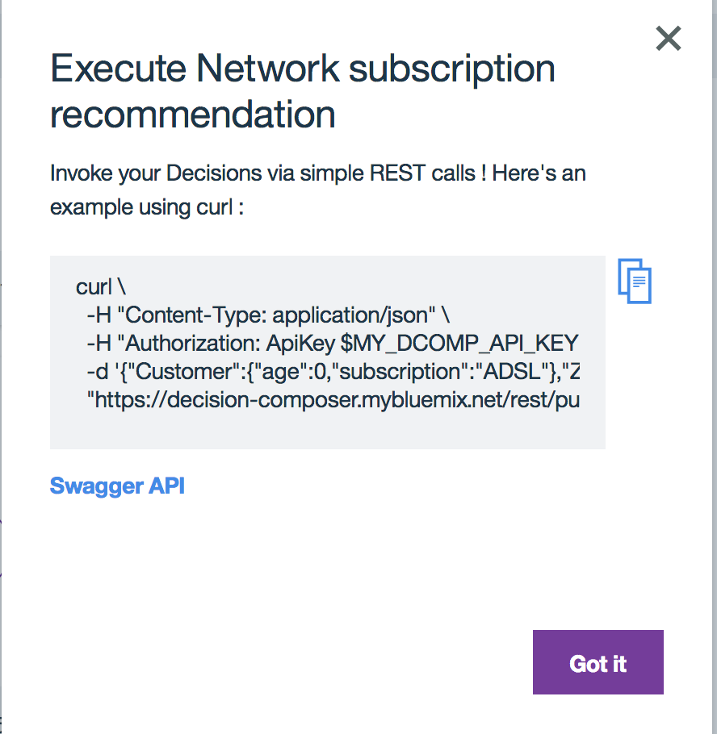
 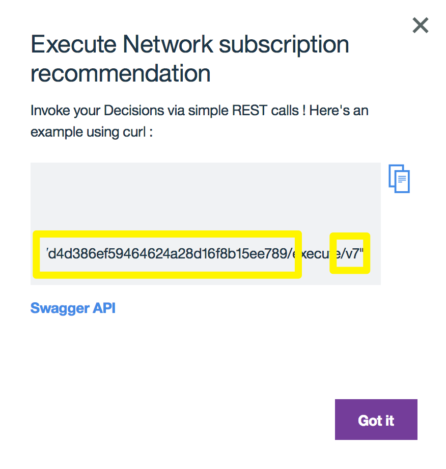
 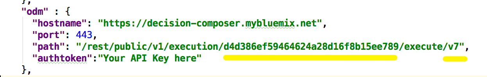

You're done! Now when the broker reaches the point in the dialog where a recommendation is needed, it will invoke the execution REST API of Decision Composer to run your project.
Note that in this demonstration, we have left the version of the project hard-coded in the config file, so if you save the Decision Composer project multiple times, thus changing the revision number, you will have to update the `config.json` file


### Execute the web app locally.
* Go back to the root of the repository, execute the following commands to get node packages dependencies, build the angular 4 front end, and start the web server:
```
npm install
npm run dev
```
* Point your browser to `http://localhost:3001`, select the `Support Bot` the advisor will display the chat panel:  

  

The 'select' widget is for demonstration to select one of the predefined customer.

## Watson Assistant Logic
For deep dive tutorial on Watson Assistant see [this documentation](https://www.ibm.com/cloud/garage/tutorials/watson_conversation_support). In this implementation there is one intent to assess the relocation question. One entity to define the potential subscription a customer may have. The values for this entities could come from a MDM reference data. The dialog flow is simple with one main node to process the relocation request.

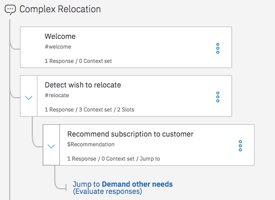   

The node uses slots with the predefined system entities of date and number, and ask related questions if they were not identified.

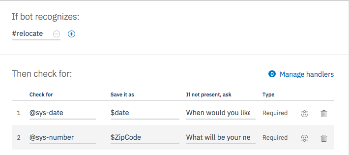

The response part is using the context object to set an action variable that will be used by the conversation broker code to propagate the conversation context to ODM for the rule processing:

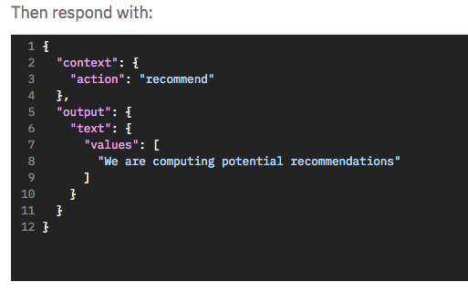

Finally when the recommendation comes back from ODM, it is a new object in the context. So it is easy in a child node to build an appropriate message.


We use this approach to keep the conversation inside WA. It will be possible to build the response directly inside the rules and the conversation broker will present directly the response from ODM to the end user.  

## ODM Decision Composer project
Using Decision Composer, business users can model the decision to be taken at a certain point during a business process, or during the flow of a conversation.
A Decision Project is composed of three parts:
* the *Data Model* contains the classes and attributes of the data elements which are used within the decision, including for representing its input and output data.
* the *Decision Model* is a dependency graph used to decompose the main decision to be taken into sub-decisions and input data.
* the *Decision Logic* are the rules and decision tables implementing each decision (or sub-decision), in a format and language suitable for business user: close to natural language, yet formal enough that it can be compiled into executable form.

Looking further at the Decision Model for this project, represented in the following diagram, one can see that the product `recommendation` is the top decision (decisions represented by blue rectangles)

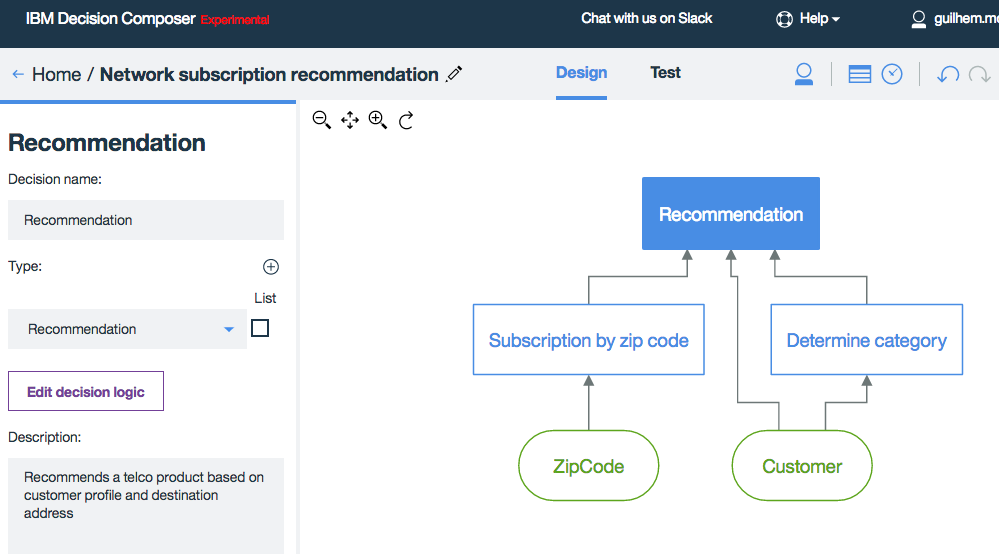

The project decides what product to recommend based on two input data (green rounded shapes): the Zipcode the customer wants to move to, and the Customer record itself. It is composed of two sub-decisions:
* _Subscription by zip code_ computes which service is available at the destination address. In this case, we've simply captured this information in a simple decision table.
* _Determine category_ is establishing the customer profile based on its data. Here we're simply classifying the customers in 3 groups: Student, Adult, Retiree, which are used in the final decision.

The *Decision Logic* of main decision (_Recommendation_) implements it using a Decision Table: Each row is a rule, light grey columns are conditions on data, and darker grey columns are actions, setting the type of product and price tag:  


which is built to suggest Adult and Students to upgrade to Fiber access (if available), while giving a discount to Students and Retired.

Once deployed to the business rule service the decision is a ruleset in the ODM Business rule services as illustrated in the screen shot below. It can thus be invoked through various means, including a REST call, like any other ODM Decision Service.

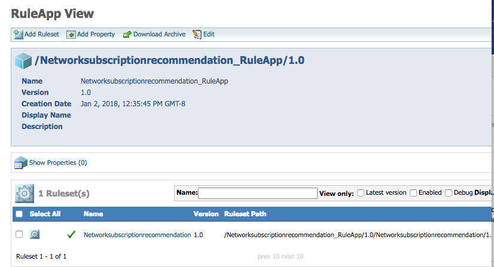

## Code explanation
The two most important points to be noted in the code base are:

* server/routes/features/conversation.js is the code that handle the round-trip with Watson Assistant. It stores the conversation context and sends it back to WCS every time the user enters something in the input textfield. WCS then performs natural language understanding, detects the intent, and where to continue the dialog, and returns an updated context. When this code sees the `recommend` keyword in the "actions" part of the context, it knows its time to call ODM.

* ODMClient.js handles the call to the ODM Decision Service. It gathers input data by merging the WA context object and additional external data - in this case a Customer record. Then it invokes the Decision Service through a REST POST on the Business Rule Service instance you've created. Finally, when the output is obtained - the Decision - it adds it back to the Watson Assistant context and recalls the conversation for getting the final message.

```javascripts
if (response.context.action === "recommend") {
    odmclient.recommend(config,response,res, function(odmResponse){
      if (config.debug) {
          console.log('Sent back to WCS: ' + odmResponse);
      }
      sendMessage(config,odmResponse,config.conversation.workspace,res,function(config,res,response){
            res.status(200).send(response);
          });

    });
```
One of the programming challenge is to play well with the asynchronous call done by the HTTP module and chain callback function. In the code above the third argument is the next function to call when the HTTP response arrived in the ODM client. SendMessage is the method used to call Watson Conversation.

## Potential improvements
The data model for the rule execution can be enriched and defined as a Java model, then a dedicated rule project can be done and deployed using the standard ODM concept of operations and tooling.

## Compendium
* [Cognitive conversation paper](https://www.ibm.com/devops/method/content/architecture/cognitiveConversationDomain)
* [Watson Assistant Training](https://www.ibm.com/cloud/garage/tutorials/watson_conversation_support)
* [ODM Decision composer](http://ibm.biz/DecisionComposer)
* [Angular 2 Material](https://material.angular.io/components/categories) used for widget in UI.


## Contribute
See the process in [main cognitive repository](https://github.com/ibm-cloud-architecture/refarch-cognitive).
