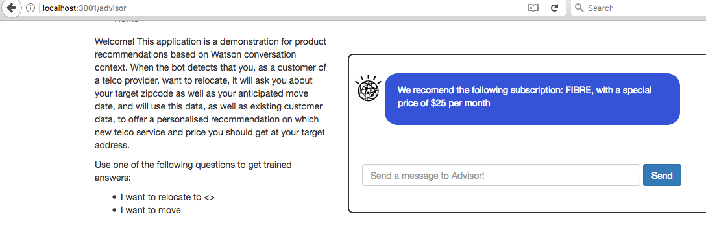
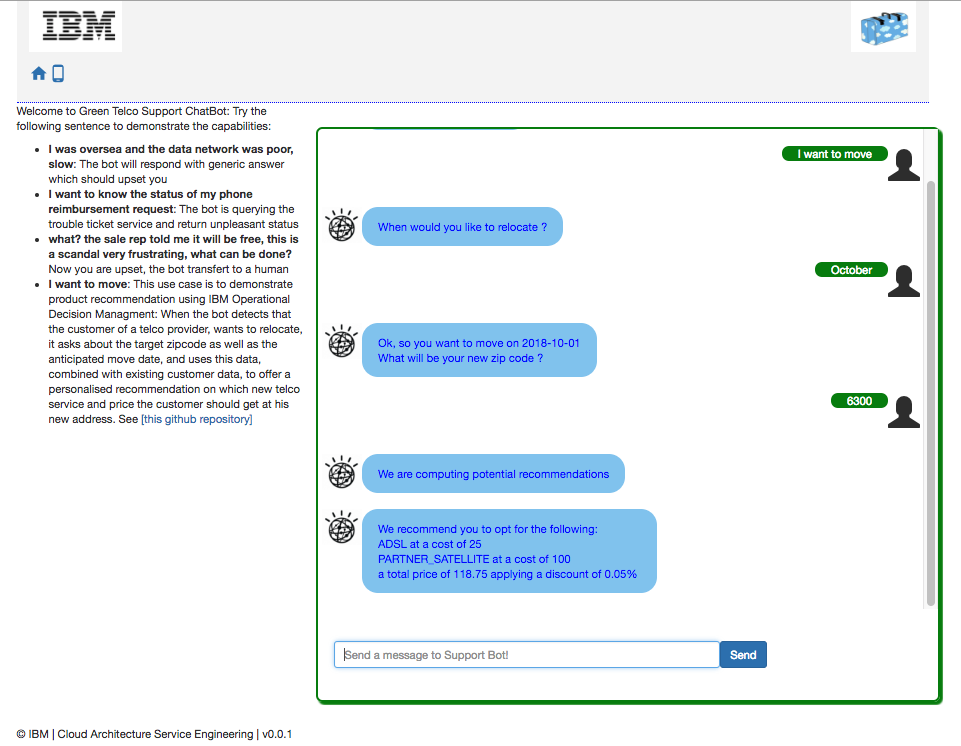
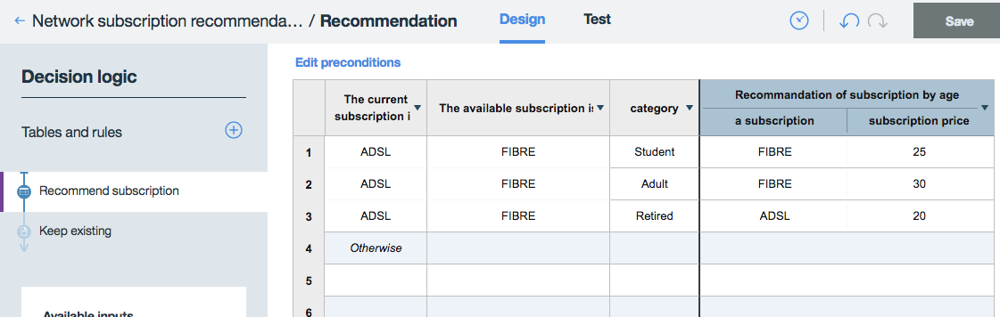

# Telecom Product Recommendations with Watson Conversation and Decision Management

This project demonstrates how to leverage Watson Conversation to gather information about the customer intent, and propose the best product recommendations from his profile and the set of answers / facts gathered during the conversation.

This project is part of the **IBM Cognitive Reference Architecture** compute model available at https://github.com/ibm-cloud-architecture/refarch-cognitive.

## Architecture
The current project is supporting the following architecture:


The broker code is managing the interaction with end users via different channels. For demonstration point of view the web interface will be used. The Watson conversation is supporting the natural language understanding with intent classification and entity extraction, and then dialog flow. ODM decision engine is used for best action and recommendations to be added on top of the conversation.

From a design and implementation point of view the solution illustrates how to consume a Watson Conversation workspace into [ODM Decision composer](http://ibm.biz/DecisionComposer) to prepare the object model for rule authoring.

## Use Case
This project shows how a customer could have a dialog with his telco operator when he wants to move. The chatbot will detect the intent to move, and ask questions to get the data of the move and the zipcode of the new address. The idea is to use the date to check if the telco provider can actually provide a transfer of service before the move date. And to check the available service at the destination address, so as to recommend the best product.
So the bot gathers the data from the customer, and at a given point of the dialog, the broker will invoke a Decision Service, implemented with ODM Decision Composer, to offer a product recommendation.



## Build and run
The code is a reuse of the conversation broker code detailed in [this project](https://github.com/ibm-cloud-architecture/refarch-cognitive-conversation-broker)
In summary, follow those steps:
* clone this repository
* also clone the [reference repository](https://github.com/ibm-cloud-architecture/refarch-cognitive-conversation-broker) for the broker, since it contains the source for the Watson Conversation workspace and the ODM Decision Composer project
  * WCS workspace in [that reference repository](https://github.com/ibm-cloud-architecture/refarch-cognitive-conversation-broker)/wcs-workspace/Complex-Relocation-workspace.json
  * ODM Decision Composer project in [that reference repository](https://github.com/ibm-cloud-architecture/refarch-cognitive-conversation-broker)/wcs-workspace/Network_subscription_recommendation.dproject
* After having created an instance of the Watson Conversation service in your IBM Cloud space, [log into WCS](https://watson-conversation.ng.bluemix.net/), import the project, then click on the View Details menu to display the workspace ID, and copy it to the clipboard:

* edit the [this repository]/server/config/config.json and paste this id as the value for the conversation.workspace3 field.
* while in this file, also set the credentials correctly. You can generate credentials for access to your instance of WCS and view them from the _Service Credentials_ page of your service, as show here:

With these steps done, the broker will now be able to access you own instance of the WCS service, invoking your own copy of the conversation project.

* in IBM Cloud, create an instance of the Business Rule Service. Open the RES console by clicking the Open Console link (highlighted below) and supplying the credentials 'resAdmin / your password'.

* display the About dialog box, and verify that your version number is at least *8.9.1.0* IFix 10, as shown below. If you already had an instance of the Business Rule Service and its older than that, it will not work with Decision Composer.

* go back to the Connection Settings page of the Business Rules service on IBM Cloud, and use the information in the bottom section to update your config.json file with the correct odm.hostname and odm.authtoken (at the bottom of the page, under the label "Basic Auth").

* in [ODM Decision composer](http://ibm.biz/DecisionComposer) import the _Network_subscription_recommendation_ project and examine it. You can Test it within Decision Composer, sample data is provided.
* from the Home page of Decision Composer, click on the project's menu and Deploy it to the Business Rules Service instance you've created earlier. This will be needed for runtime execution.

* go back to the root of the repository, execute the following commands:
```
npm install
ng build
npm start
```
* and point your browser to localhost:3001
The advisor will display:


## ODM Decision Composer project

The project decides what product to recommend based on two input data: the Zipcode the customer wants to move to, and the Customer record itself. It is composed of two sub-decisions:
* _Subscription by zip code_ computes which service is available at the destination address. In this case, we've simply captured this information in a simple decision table.
* _Determine category_ is establishing the customer profile based on its data. Here we're simply classifying the customers in 3 groups: Student, Adult, Retiree, which are used in the final decision.
The main decision, _Recommendation_ is implemented by a Decision Table:

which is built to suggest Adult and Students to upgrade to Fibre access (if available), while giving a discount to Students.


## Code explanation
The two most important points to be noted in the code base are:

server/routes/features/conversation.js is the code that handle the round-trip with Watson Conversation. It stores the conversation context and sends it back to WCS everytime the user enter something in the input textfield. WXS then performs natural language recognition, detects where we are in the dialog, and returns an updated context. When this code sees the "recommend" keyword in the "actions" part of the context, it knows its time to call ODM, and delegate this work to the ODMClient class.

ODMClient.js handles the call to the ODM Decision Service. It gathers input data by colating both the WCS context object and additional external data - in this case a Customer record. Then it invokes the Decision Service through a REST POST on the Business Rule Service instance you've created. Finally, when the output is obtained - the Decision - it adds it back to the context so that Watson Conversation can use it, in this case to display the recommended product.

## Compendium
* [Cognitive conversation paper](https://www.ibm.com/devops/method/content/architecture/cognitiveConversationDomain)
* [ODM Decision composer](http://ibm.biz/DecisionComposer)


## Contribute
See the process in [main cognitive repository](https://github.com/ibm-cloud-architecture/refarch-cognitive).
