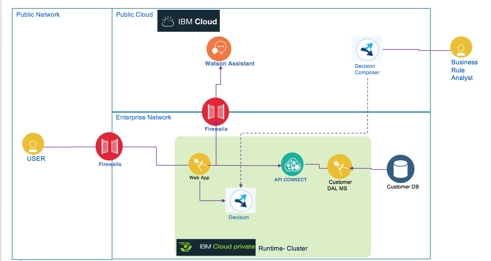

# Telecom Product Recommendations with Watson Conversation and Decision Management

This project demonstrates how to leverage Watson Conversation to gather information about the customer intent, and propose the best product recommendations from his profile and the set of answers / facts gathered during the conversation.

This project is part of the **IBM Cognitive Reference Architecture** compute model available at https://github.com/ibm-cloud-architecture/refarch-cognitive.

## Architecture
The current project is supporting the following architecture:

The broker code is managing the interaction with end users via different channels. For demonstration point of view the web interface will be used. The Watson conversation is supporting the natural language understanding with intent classification and entity extraction, and then dialog flow. ODM decision engine is used for best action and recommendations to be added on top of the conversation.

From a design and implementation point of view the solution illustrates how to consume a Watson Conversation workspace into [Decision composer]() to prepare the object model for rule authoring.

### Service involved

## Build and run
The code is a reuse of the conversation broker code detailed in [this project](https://github.com/ibm-cloud-architecture/refarch-cognitive-conversation-broker)

## Code explanation

## Compendium
* [Cognitive conversation paper](https://www.ibm.com/devops/method/content/architecture/cognitiveConversationDomain)
* [Decision Composer]
* [Operational Decision Management]
* [Run your business decisions in Kubernetes](https://www.ibm.com/developerworks/library/mw-1706-feillet-bluemix/1706-feillet.html)

## Contribute
See the process in [main cognitive repository](https://github.com/ibm-cloud-architecture/refarch-cognitive).
