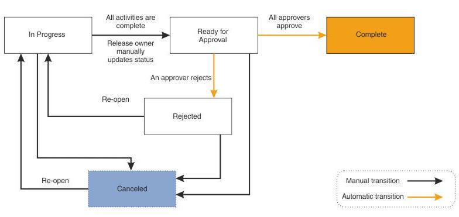

# ODM Rule Governance Summary

Governance is a **built in** capability in ODM v8.5+

It is an **end to end** governance methodology

Provides decision governance **at business level**

Policy change management is **controlled** and **tracked**

## Releases

Decision service policy changes are managed in releases.

Every release has an owner and approver(s).

A release cannot be deployed until it is fully approved.

Work inside activities are split into **change activities** and **validation activities**.

## Change activities

Change activities allow rules to be modified on the release.

Change activities have an **owner**, an **author** to perform changes, and an **approver** for the change activity.

## Validation activities

Validation activities are for performing validation tasks on the release.

Validation activities have an **owne**r, a **author** to perform validation tasks, and an **approver** for the validation activity.

## Approvals

Decision service releases and each activity within the release has its own approval cycle.

