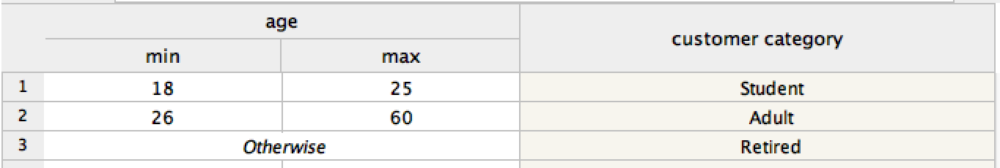

# Product Recommendation Rule explanation

## Introduction
The product recommendation decision services address the scenario in which an existing customer would like to move to a new address. The products available at the new address may not be the same ones available at the current address. The decision service will recommend a new set of products for the customer based on their existing products, their new location, and the customer churn or the possibility that this customer might leave to another company that has better prices or a product set that better fits their needs. 

## Rule flow
The high level steps or tasks needed to make the decision are captured in the ruleflow diagram below

## Bundle Definition
In the first task we define the concept of a Bundle. A Bundle is a set of related products with some special features when combined, for example special pricing for purchasing all the products in the Bundle. The decision table, pictured below, allows the business user to define the Bundles independently of the main product database and to control these product offerings. 

In the action part of the rule, the Bundle is created and inserted into working memory. As we will see later, they are subsequently used to  determine a discount amount for customers who purchase the Bundle.

## Product Availability
The product availability rules simply tell for each zip code which products are available in that area. Since the telecom company offers Phone, TV, and Internet products, there is describing the availability by zip code for the products in each of these categories. Of particular interest here for some of the recommendation scenarios, when the customer moves to an area where the company does not offer a TV product, the rules automatically recommend that the customer partner with a satellite company. 

## Product Removal 
With a baseline set of available products from which to choose, the next step is to remove any products from consideration that will not be a good match. In particular, IPTV, one of the TV offerings, is only recommended if the customer has sufficiently fast internet. The rule says, if they have ADSL, the slowest internet, do not recommend IPTV for this customer. 

## Customer Profiling
Next, the rules categorize the customer as one of Retired, Adult, or Student based on their age. Different products may be more appropriate for different categories of customer. 

## Product Recommendation
For each of the three categories of products, we can now make a recommendation for this customer based on their existing products, the available products and the customer categoy. For example below is the table that recommends different internet subscriptions for each category of customer. Similar tables exist for the other product types.

## Price Calculation
The final price is calculated by applying a discount for the likelihood of customer churn and the products the customer has selected. The table below shows that the discount increases as the customer churn score increases. 

The products selected determine whether the customer is eligible for a Bundle discount. If the customer has selected products that are in a Bundle, they will receive the Bundle discount. 

## Finalization
In the last step the total price is calculated as the sum of the prices of all the products multiplied by 1 minus the discount percentage. 
