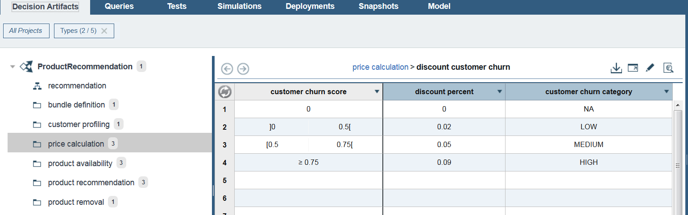
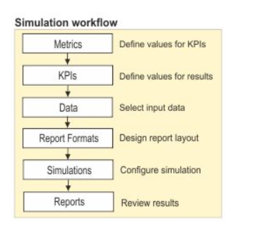
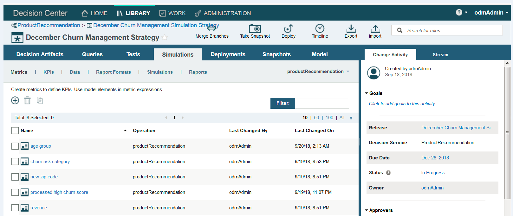
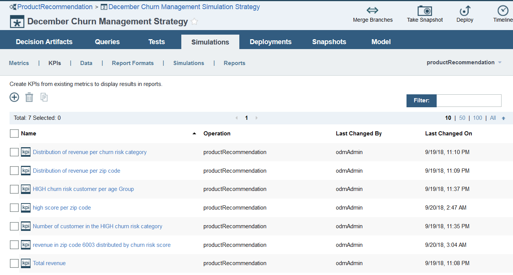
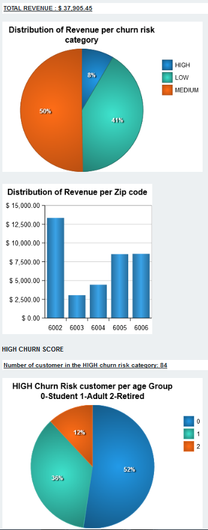
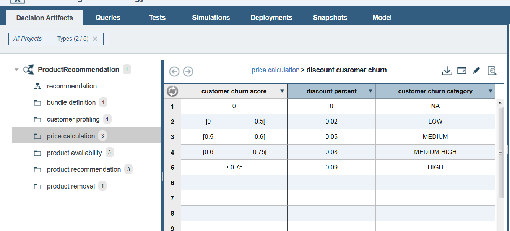
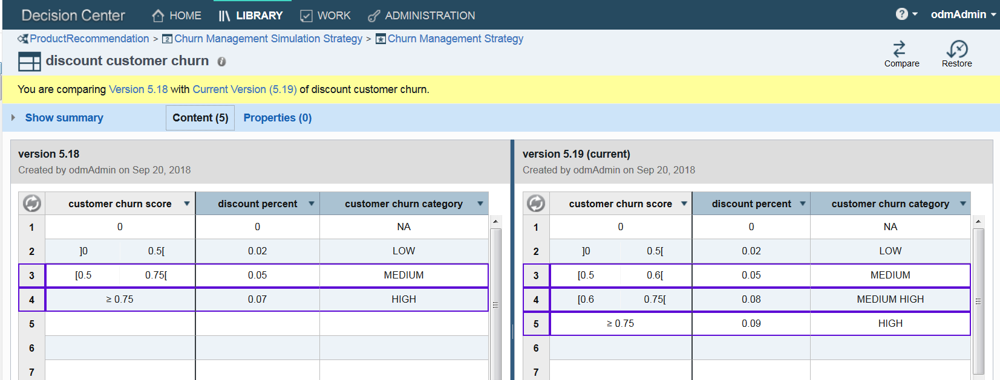
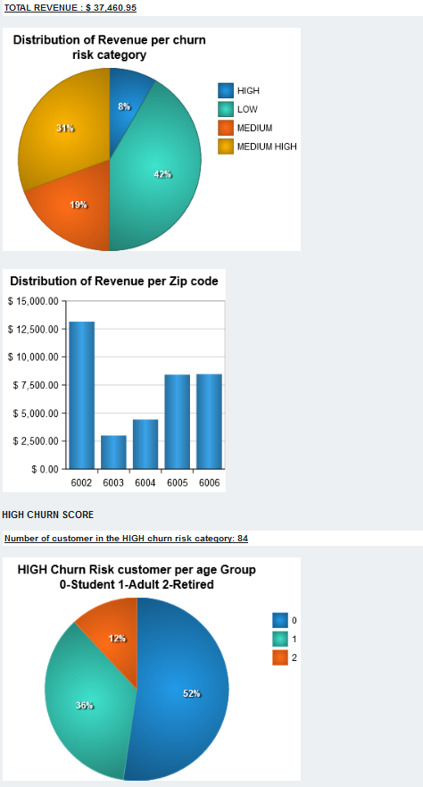
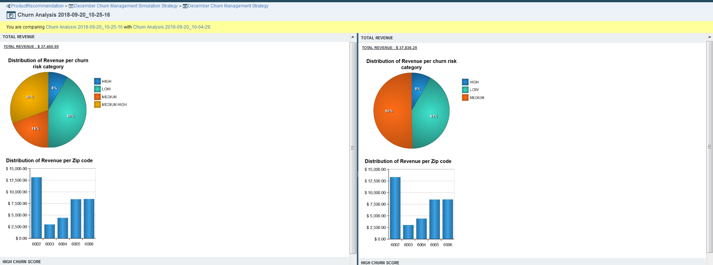
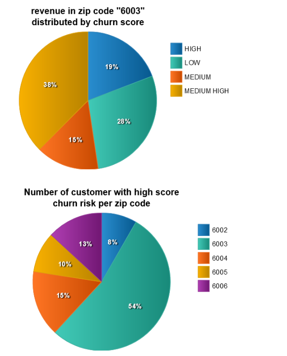

# ODM Simulation Practices

Update 09/29/2018- Author: [Jean Luc Correa - ODM Consultant - France](https://www.linkedin.com/in/joseph-luc-correa-00389333/)

## Use ODM simulation capabilities to evaluate a churn management strategy

This part demonstrates how a churn program manager can use ODM simulation capabilities to evaluate a churn management strategy.

We will in the first part introduce what challenges are typically faced by churn program manager, show the different step to build a simulation (how to put together the metrics, the KPI the data and the report formats)
Notes : For the demo we are using an excel file but ODM allow to use a “custom data provider” to get data from an external database hence using real historical data. The [Customer database](https://github.com/ibm-cloud-architecture/refarch-integration-inventory-db2/tree/master/db-sql/customers) can be used for that.

Then, we will run the simulation, analyze the report, change our discount churn Decision Table to evaluate the financial cost of adding a new churn risk category. We will add new KPIs, run again the simulation and compare the result to the previous simulation run.

## Table of contents
* [The Challenge](#the-challenge)
* [Steps to build a Simulation](#steps-to-build-a-simulation)
* [Simulation Run and report Analysis](#simulation-run-and-report-analysis)
* [Policy update](#policy-update)
* [Simulation Report Comparison](#simulation-report-comparison)

## The Challenge

The rule: “ discount customer churn” below shows how the project uses ODM to apply a discount to customers based on their churn risk score.
 The rule currently has 3 churn risk categories (LOW, MEDIUM, HIGH)

A challenge a churn management program manager typically face is to evaluate the accuracy and cost effectiveness of his churn management strategy.
* Does the company use the right number of churn risk category?
* Does it use the right threshold value for each category?  
* use the right discount value?

If the 3 customer segments (LOW, MEDIUM, LARGE) are too large, the company might be giving too much discount to some customers that do not need it and erodes its revenue or giving not enough discount to customer important to us and loose them.
Another possible challenge is: would it be possible to  detect and act on churn problem in specifies area (zip code)?

ODM allows to run simulation against historical data to (learn) evaluate how much the company churn management discount policy would likely cost it.

## Steps to build a Simulation

The churn program manager defines metrics and KPI to measure the quality and impact of a change and compare it to different alternatives

**Metrics**

Metrics define the values that are used in the KPIs. You must create metrics before you can make KPIs. We define metrics by using the business model language and it represents an individual output value of a decision service invocation:

* Revenue: The price of the recommendation
* New Zip code : The zip code of the customer
* Churn risk category : the churn risk category of customer
* Age group: the age grouping of the profile of customer

We can define conditional expression on  metrics
Ex : revenue for zip code in specific area
the total price of 'recommendation' when the new zip code of 'customer' is "XXXX"

**KPIs**

KPIs show the results from running a simulation. To define a KPI, you pair a metric with a KPI value.
The KPI is an aggregation of a metrics on all the simulation execution.
For example, to create a KPI that shows the total estimated revenue based on the product recommendations that are handled by the application, you might use the KPI expression sum of 'Revenue' (revenue is the metrics we defined earlier).  When the simulation runs, it adds up the amounts of the revenue and displays the total in the simulation report.

* KPI1: Total revenue: sum of 'revenue'
  KPI are of two types
  -	a single value that was taken from a group of values. (like the sum we just did
  -	a set of values : that show a distribution :
  for example, a KPIs simulation might group the total revenue for each  zip code : In this case, the report can display the set of values in a graph such as a pie chart.
* KPI 2: Distribution of revenue per zip code
sum of 'revenue' grouped by 'new zip code'  

* KPI 3 : Distribution of revenue per churn risk category
sum of 'revenue' grouped by 'churn risk category'

* KPI 4 : Number of customer in the HIGH churn risk category
number of 'processed high churn score'

* KPI 5:  HIGH churn risk customer per age Group
number of 'processed high churn score' grouped by 'age group'

**Data**

Simulations use business information that is provided as input data. To run a simulation, we can use real data, ODM provides a custom data provider which allows to connect to real data,
or we can use excel file.

The Excel format displays data clearly and can be changed easily.
You can generate and download an Excel data file from the Business console, add data to it locally, and then upload it back to the console. That is what we are using for this demonstration

**Report formats**

When you run a simulation, it displays its results in a report. You can define various reports for a simulation to generate different reports.
You lay out a report in a template by adding sections and KPIs. You can add as many elements as necessary. The KPIs can be displayed as text or as graphs (PIE, Bar, line)

We have defined a report format called Churn Model, where we compute, in a first section
the `Total revenue`, `the distribution of revenue per churn risk category`, and the `distribution of revenue per zip code`.

In a second section we take a further look at the high churn population computing their number and how they are distributed per age group (Student, Adult, Retired).

Configuration of the KPI:distribution of revenue per churn risk category

**Simulations**

You configure a simulation to bring together input data, an application server, and a report format. When you run the simulation, it uses rules from the associated decision service and places the results in a report.
You can interrupt the generation of a report during a simulation. If you do, the report is still created, but it contains only partial results.

## Simulation Run and report Analysis

We are looking at a segment of a population in 5 Areas

We see that 50%  of our estimated revenue come from a population with a medium churn risk category.  It is a big category in term of revenue. This category regroup customer with a churn score from 0.6 to 0.75 %. Are we addressing accurately our customer doing enough commercial effort in that category? isn’t that category too big?

Given the size of this category, the company might be giving too much discount to customers at the low end of this category and or giving  not enough discount to  customers at the high end of this category.
We will evaluate what would be the impact of introducing a new category (MEDIUM HIGH). Let’s assess how this new category with a special discount would affect our revenue?

If we look at the revenue distribution per zip code, we can see that  we make less revenue in the zip code 6003. What are the reasons?
Is it simply an area where we have less customer than in the others area or is it an area where our competitors are particularly aggressive? it is an area where customers have a high likelihood to churn?
We can add new KPIs specifically to investigate more this area.
The last diagram “high churn risk category per group age” which regroups the customers in the high category of churn risk regrouped by age (Student, Adult, Retired).
We observe in our sample population that the group age that is more likely to churn is the student group followed by the adult group.
We can add more rules that add additional  benefit specifically to retain student customers.

## Policy update

### Change Discount Table:
We will change our discount table based on churn risk score and assess how much would the change cost in term of revenue.

We add a new row for the category of customer with a churn risk score between 0.6 and 0.75. We call this category MEDIUM HIGH

We can compare our change with the previous version. The new version is on the right.

### Adding two KPI
We also change the report format to add a new section, we add two metrics and two new KPIs
* KPI1 : High score per zip code: number of `processed high churn score` grouped by `new zip code`  
* KPI2 : revenue in zip code 6003 distributed by churn risk score : sum of `revenue for zip code 6003` grouped by `churn risk category`.

We update our report format to include a new section  to investigate the zip code 6003 area. Now let’s run again the simulation.

## Simulation Report Comparison

The result of the new simulation run  show that even with a discount applied on the new category (churn risk between 0.6 and 0.75 ) 31%  of our revenue came from that new segment. So, in total almost 40 % of our revenue come from a population with medium high to high risk of churn.
We can conclude that the segment with customer of medium risk (0.5 to 0.75) we were addressing previously is not accurate enough.
We can run more  simulation to continue to asses and refine the value of the discount we want to put on the new “MEDIUM HIGH” segment

We can let ODM compares two selected simulation run:

We see in the new report that 54% of the population with high churn score live in the 6003 zip code area and that 60% of the revenue in that area come from customer that are likely to churn (medium high to high segment)
We need to implement a strategy that will be more aggressive for that area.

## Conclusion
In summary we have created metrics, KPIs, and configured simulation report format, to evaluate a churn management strategy. We ran different simulation, compared different alternatives and make improvement decision based on the simulation result.

We have demonstrated in this part  how a business churn program manager can use ODM simulation capabilities to assess and improve a churn management strategy.
